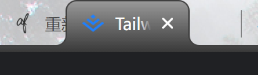
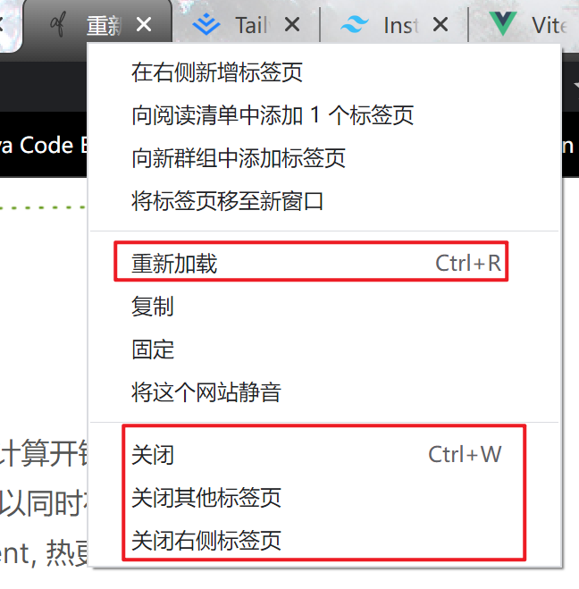

# 多标签页设计 Vue 3 + Typescript + Vite

首先，我们有一个基本页面

然后多标签页就是要适配这个页面上面的路由，提供一个便捷跳转的功能

所以，多标签页本质上多标签页是一个**附加增强功能**。

既然是增强功能，那就有要被增强的对象，因为被增强的对象如下：

我们期望实现的功能是，类似 chrome 浏览器多标签页的功能：

首先是可以在标签页的范围内随意拖放：

然后是可以右击展示附加功能：

